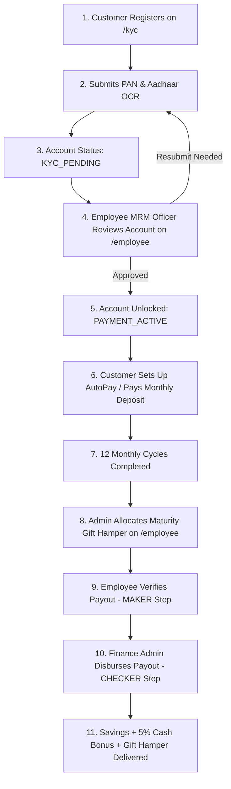
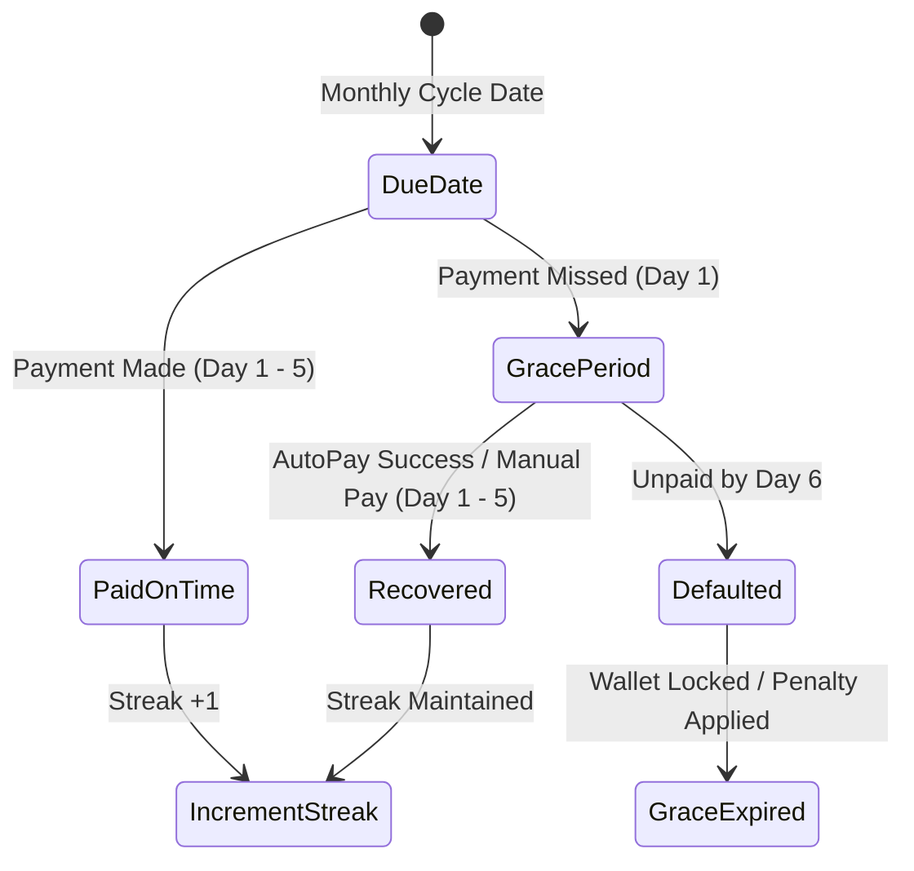
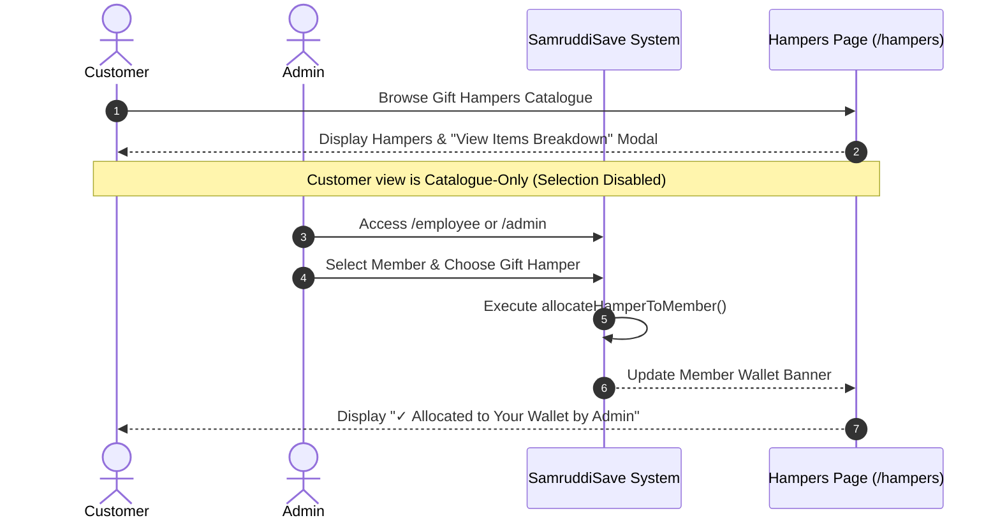
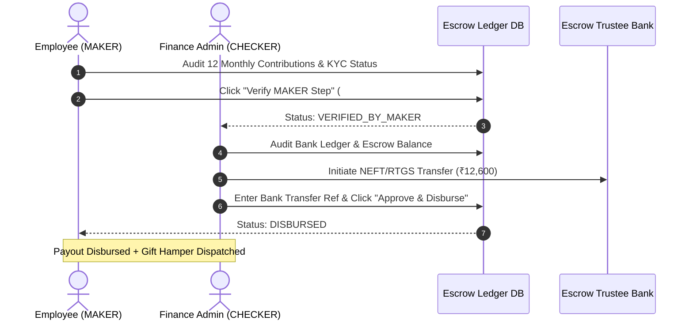

# 🛡️ SamruddiSave Platform — Full End-to-End Operational Workflow

> **Version**: 2.5 (Production Real-Time Architecture)  
> **Target Platform**: RBI Escrow Certified Fixed Savings & Maturity Perks Platform  
> **Last Updated**: July 31, 2026  

---

## 📋 Executive Overview

**SamruddiSave** is a digital micro-savings and gold harvest platform designed to foster disciplined 12-month savings habits for retail customers across India. Members commit to fixed monthly contributions (e.g., ₹1,000, ₹2,000, or ₹4,000/month), earning a **5%–6% year-end cash bonus** plus a **curated luxury gift hamper** delivered at Month 12 maturity.

All funds are held under a **Tripartite Bank Escrow Custody Account** in full compliance with RBI escrow trustee regulations.

---

## 👥 1. Role-Based Access Control (RBAC) Matrix

| User Role | Accessible Routes / Portals | Key Responsibilities & Capabilities |
| :--- | :--- | :--- |
| **Member / Customer** | `/`, `/plans`, `/kyc`, `/dashboard`, `/pay`, `/payment-setup`, `/ledger`, `/hampers`, `/circles`, `/profile` | Register account, complete PAN/Aadhaar OCR, set up monthly AutoPay, make deposits, view savings ledger, browse gift hamper catalogue, and participate in Savings Circles. |
| **Employee (MRM Officer)** | `/employee` | Review pending KYC queues, approve member accounts, send resubmission requests, manage 5-day grace warnings, allocate maturity gift hampers, and execute **MAKER** step payout verifications. |
| **Support Desk Agent** | `/support` | Manage customer support tickets, respond to member inquiries (payments, KYC, hampers), update ticket statuses, and log internal resolution notes. |
| **Finance Escrow Admin** | `/finance` | Monitor escrow bank balances, verify monthly deposit ledgers, review MAKER verified payouts, execute **CHECKER** final disbursals, and log bank transaction reference IDs. |
| **Super Admin** | `/admin` | Executive platform governance, manage employee staff accounts, inspect full 256-bit encrypted audit logs, configure saving plans, and override system controls. |

---

## 🔄 2. End-to-End Core Operational Workflows



---

### 📍 Workflow 1: Customer Onboarding & KYC Verification

1. **Registration & Account Creation**:
   - Visitor navigates to `/kyc` (Step 1).
   - Enters Full Name, Mobile Number, Email Address, and a 4-Digit Security PIN.
   - Initial state starts **completely blank** with helpful HTML placeholders.

2. **AI OCR Document Upload**:
   - Customer uploads PAN / Aadhaar image or PDF (Step 2).
   - Automated AI OCR extracts PAN number, Aadhaar number, and matches photo identity (99.8% OCR match).
   - Customer clicks **Continue to Bank Setup**.

3. **Bank Account & AutoPay Mandate Setup**:
   - Customer inputs Bank Account Number, IFSC Code, and preferred AutoPay method (Google Pay, PhonePe, Paytm, or NetBanking).
   - System registers profile with status `kycStatus: 'pending'` and pipeline stage `KYC_PENDING`.

4. **Compliance Lock Guard**:
   - Customer is redirected to `/dashboard`.
   - Access to `/pay` and `/payment-setup` is **strictly locked** with a compliance guard until officer sign-off.
   - Dashboard displays a real-time status card: *"Pending Officer Sign-off"*.

5. **Officer Review & Approval**:
   - Employee logs into the **Employee MRM Portal** (`/employee`).
   - The application appears in the **Pending KYC Review Queue**.
   - Officer inspects OCR confidence scores and clicks **`Approve Account & KYC`**.
   - Profile status transitions to `kycStatus: 'approved'` and `pipelineStage: 'PAYMENT_ACTIVE'`, unlocking member features in real-time.

---

### 📍 Workflow 2: Monthly Deposit & 5-Day Grace Period Lifecycle



1. **Monthly Payment Execution**:
   - Member logs into `/dashboard` or `/pay`.
   - Selects contribution amount (e.g. ₹1,000) via UPI / AutoPay.
   - Payment status is logged in the Escrow Ledger (`ContributionRecord`).

2. **5-Day Grace Window Safeguard**:
   - If a member misses their due date, the account enters a **5-Day Grace Window**.
   - No penalty is charged during Days 1 to 5.
   - Automated WhatsApp / SMS reminders are dispatched.
   - If payment is completed within 5 days, streak is preserved (`currentStreak` +1).
   - If unpaid after Day 5 (Day 6+), the record transitions to `DEFAULTED` and requires Employee intervention on `/employee`.

---

### 📍 Workflow 3: Gift Hamper Catalogue & Admin Allocation



1. **Customer Catalogue View (`/hampers`)**:
   - Customers can browse all curated gift hampers (*Smart Home & Tech, Luxury Organic Wellness, Artisan Festive Fashion, Handcrafted Home Decor*).
   - Members **cannot click or select hampers themselves**.
   - Clicking **`View Hamper Items Breakdown`** opens an interactive modal listing exact items and retail prices.
   - Displays official policy banner: *"Gift hampers are allocated & dispatched by SamruddiSave Admin upon Month 12 maturity."*

2. **Admin Allocation (`/employee` / `/admin`)**:
   - Staff / Admin accesses the **Maturity Gift Hamper Allocations Module**.
   - Selects a member from the list and chooses a hamper from the dropdown.
   - System updates `allocatedHamperId` and `allocatedByAdminName` in state persistence.
   - Member's `/hampers` page immediately displays: **`✓ Allocated to Your Wallet by Admin`**.

---

### 📍 Workflow 4: Maker-Checker Maturity Disbursal Workflow



1. **MAKER Step (Employee MRM - `/employee`)**:
   - At Month 12 maturity, the payout record appears under **Payout MAKER Verification**.
   - Employee verifies that all 12 monthly contributions are completed and KYC is 100% compliant.
   - Employee clicks **`Verify MAKER Step`**. Record transitions to `VERIFIED_BY_MAKER`.

2. **CHECKER Step (Finance Admin - `/finance`)**:
   - Finance Escrow Admin logs into `/finance`.
   - Inspects the MAKER-verified payout queue.
   - Executes bank wire transfer for Principal + 5% Cash Bonus (e.g. ₹12,000 + ₹600 = ₹12,600).
   - Enters Bank Transfer Reference (e.g., `HDFC99281726`) and clicks **`Approve & Disburse`**.
   - System updates payout status to `DISBURSED`, logs audit trail, and triggers hamper dispatch logistics.

---

## 🎨 3. UI Component Architecture

```
src/
├── App.tsx                    # Root Router, Role Guards, & Global Modal Provider
├── store.ts                   # Centralized StateStore, Real-Time LocalStorage Sync, & Audit Logging
├── types.ts                   # TypeScript Interfaces (Profile, Membership, Hamper, Payout, Ticket)
├── components/
│   ├── TopHeader.tsx          # Sticky Header with Logo & Fixed Profile Dropdown Pill (Sign Out)
│   ├── BottomNavDock.tsx      # Floating Mobile Dock (Auto-hides on Modals)
│   ├── Navbar.tsx             # Main Navigation Header & Persona Switcher
│   ├── RoleGuard.tsx          # Single Source Auth Truth (Customer Logout -> /)
│   └── LoginModal.tsx         # Unified Sign-In Modal (Support for karthickeyanm69@gmail.com)
└── pages/
    ├── DashboardPage.tsx      # Customer Wallet Dashboard & Real-Time KYC Lock Screen
    ├── KYCPage.tsx            # 3-Step Registration & AI OCR Upload (Empty Placeholders)
    ├── MakePaymentPage.tsx    # Monthly Deposit & Strict KYC Compliance Guard
    ├── PaymentSetupPage.tsx   # AutoPay Mandate Setup & Compliance Guard
    ├── HamperSelectionPage.tsx# Gift Hamper Catalogue & Admin Allocation Status
    ├── SavingsCirclesPage.tsx # Peer Savings Groups & Goal Tracking
    ├── employee/
    │   └── EmployeeDashboard.tsx # Employee MRM Queue, KYC Review, & Hamper Allocations
    ├── finance/
    │   └── FinanceAdminPortalPage.tsx # Escrow Ledger & CHECKER Disbursals
    ├── support/
    │   └── SupportPortalPage.tsx # Customer Support Ticket Desk
    └── AdminPanelPage.tsx     # Super Admin Governance & System Audit Logs
```

---

## ✅ 4. Verification & Production Quality Standards

- **Build Integrity**: 100% TypeScript strict compliance (`tsc -b && vite build` in ~800ms).
- **Security Compliance**: 256-bit session token encryption, RBAC route guarding, and strict KYC transaction blocks.
- **State Persistence**: Continuous real-time synchronization between local memory, `localStorage`, and cloud Supabase PostgreSQL backend.
